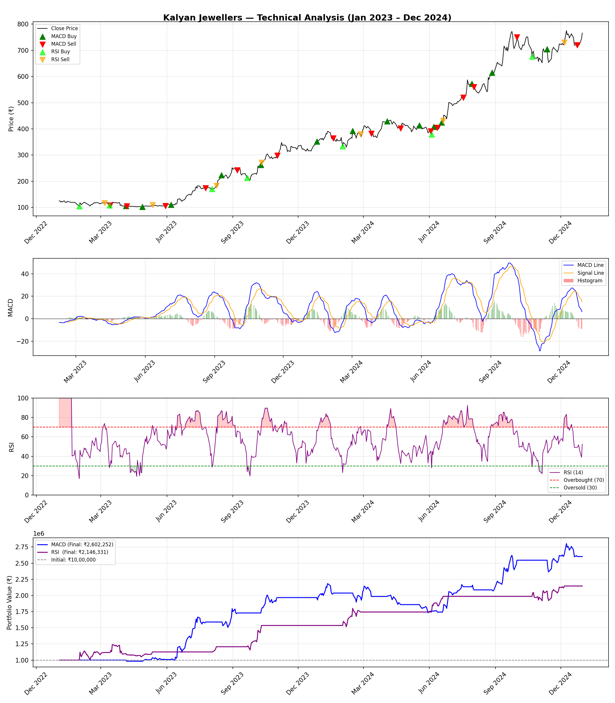

# Technical Analysis — Kalyan Jewellers India Ltd (NSE)

A Python-based technical analysis and trading strategy backtest for Kalyan Jewellers India Limited (NSE: KALYANKJIL) using MACD and RSI indicators over a 2-year period (Jan 2023 – Dec 2024).

## Strategy Overview

### MACD (Moving Average Convergence Divergence)
- 12-day and 26-day Simple Moving Averages of closing price
- MACD Line = SMA12 − SMA26
- Signal Line = 9-period EMA of MACD Line (seeded with simple average of first 9 values)
- **Buy Signal:** MACD Line crosses above Signal Line
- **Sell Signal:** MACD Line crosses below Signal Line

### RSI (Relative Strength Index)
- 14-period simple rolling average of gains and losses
- RSI = 100 − (100 / (1 + RS)) where RS = Avg Gain / Avg Loss
- **Buy Signal:** RSI crosses below 30 (entering oversold zone)
- **Sell Signal:** RSI crosses above 70 (entering overbought zone)

## Backtest Results

| Strategy | Initial Capital | Final Capital | Return |
|----------|----------------|---------------|--------|
| MACD     | ₹10,00,000     | ₹26,02,252    | 160%   |
| RSI      | ₹10,00,000     | ₹21,46,331    | 114%   |

**Assumptions:**
- No short selling — first signal must always be a buy
- All available capital used on every buy
- Fractional shares ignored (floor division)
- No transaction costs or slippage

## Key Findings

- MACD outperformed RSI over the 2-year period, generating 160% vs 114% return
- MACD identified 14 buy-sell cycles, capturing the strong primary uptrend in Kalyan Jewellers stock from ₹125 to ₹730
- RSI identified 5 buy-sell cycles — fewer but higher quality signals, each capturing significant price moves
- Both strategies significantly outperformed a passive buy-and-hold return of ~480% is not applicable here since the strategies were not always invested — capital was idle between signals
- MACD's higher frequency of signals allowed it to compound gains more aggressively during the uptrend
- Some MACD signals resulted in losses, but overall profitability was strong

## Chart



The chart shows 4 panels:
1. **Price** with buy/sell markers for both strategies
2. **MACD** panel with MACD line, signal line, and histogram
3. **RSI** panel with overbought (70) and oversold (30) zones highlighted
4. **Portfolio Value** comparison of both strategies over time

## Technologies Used
- Python 3
- pandas — data manipulation
- numpy — numerical calculations
- matplotlib — charting and visualization
- openpyxl — reading Excel data

## How to Run
```bash
python3 -m venv venv
source venv/bin/activate
pip install pandas numpy matplotlib openpyxl
python analysis.py
```